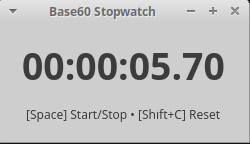

# TikTok

Stupid simple XFCE GTK4 stopwatch.

## Dependencies

```bash
sudo apt install build-essential pkg-config libgtk-4-dev
```

## Installation Steps

```bash
git clone https://github.com/grgorien/tiktok
```

```bash
cd base60tok
```

```bash
make
```

```bash
sudo make install
```

Done.

## Uninstallation Steps

```bash
make uninstall
```

## Screenshot



## Usage

- Start/Stop: Space
- Clear: (Shift + C)
